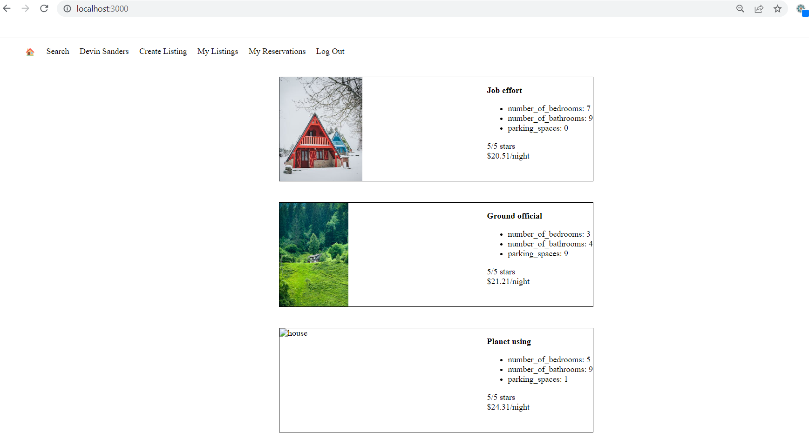

# LightBnB Project
A simple multi-page Airbnb clone that uses a server-side Javascript to display the informstion from queries to web pages via SQL queries.

## Getting Started
1. Clone the repository to you local machine.
2. Install the dependencies by running the following command: npm install
3. Set up the database by running the schema and seed files.
4. Start the server by running the following command: npm start
5. Access the application by opening a web browser and navigating to http://localhost:3000

## Final Product

## Dependencies
- bcrypt
- cookie-session
- express
- nodemon